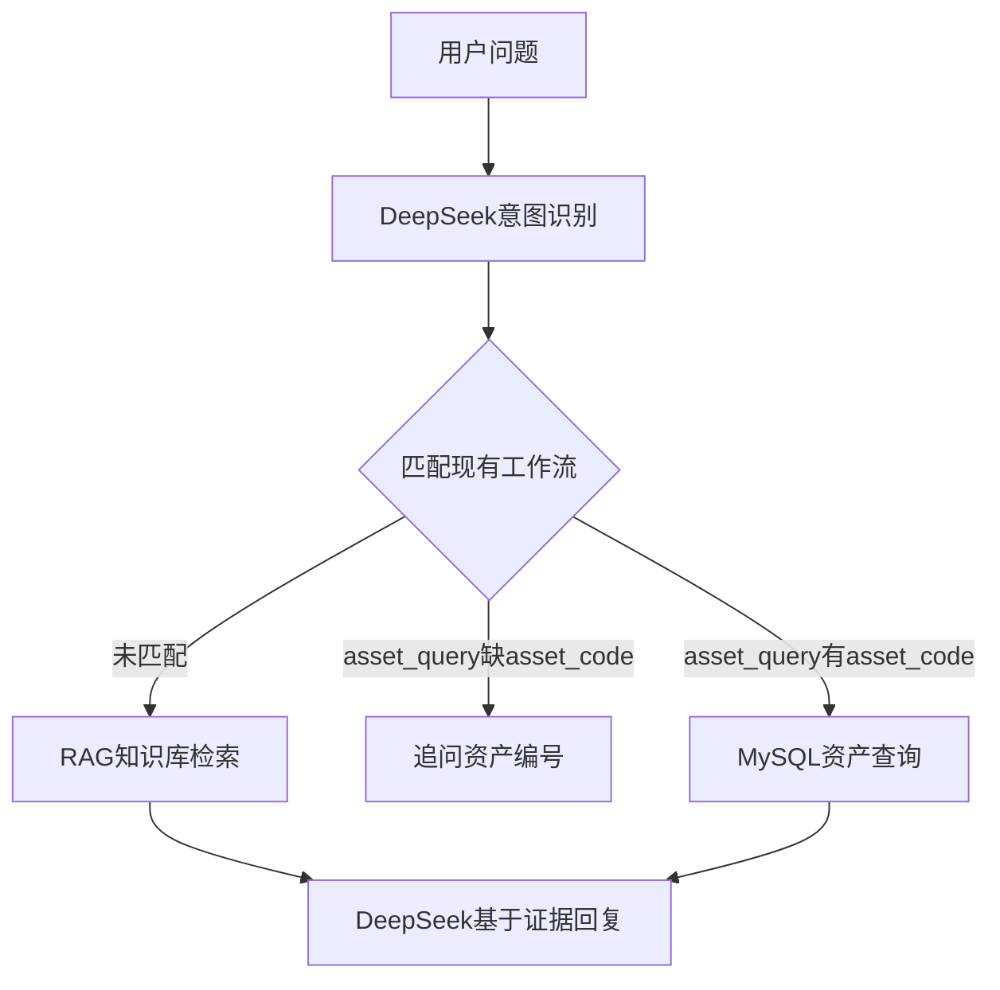

# 财经客服 Agent

当前版本使用显式 LangGraph 工作流，并由 DeepSeek 做意图识别：

1. 匹配 `asset_query` 工作流：按资产编码查询本地 MySQL `customer.asset_dossier`。
2. 未匹配现有工作流：检索 `knowledge/` 知识库，再由 DeepSeek 基于证据生成回复。

当前版本**没有**联网、实时行情、账户、订单或未授权外部系统查询能力。它适合验证意图识别、知识库检索、资产查询工作流和基础多轮对话。

## 环境要求

- Python 3.11～3.13
- DeepSeek API Key
- 首次构建索引时会下载本地中文 Embedding 模型（`BAAI/bge-small-zh-v1.5`，约百 MB）

## 安装

在项目根目录执行：

```powershell
python -m venv .venv
.\.venv\Scripts\python.exe -m pip install -e ".[dev]"
Copy-Item .env.example .env
```

打开 `.env`，填写真实的 `DEEPSEEK_API_KEY` 和 MySQL 连接信息。真实密钥不要提交到 Git。

```dotenv
MYSQL_HOST=localhost
MYSQL_PORT=3306
MYSQL_USER=root
MYSQL_PASSWORD=your-mysql-password
MYSQL_DATABASE=customer
```

默认模型是 `deepseek-v4-flash`。如果更看重回答质量，可以修改：

```dotenv
DEEPSEEK_MODEL=deepseek-v4-pro
```

## 知识库与 RAG

把业务说明放进 `knowledge/`（支持 `.md` / `.txt`）。启动时会：

1. 扫描知识库并分块
2. 优先用本地 Embedding 写入 FAISS 索引（缓存目录默认 `.rag_index/`）
3. 源文件变更后自动重建索引

如果当前 Python 环境未安装 `faiss`，项目会自动回退到轻量级本地检索实现，保证开发与测试仍可运行。

示例文档：

- `knowledge/开户与账户.md`
- `knowledge/理财产品说明.md`
- `knowledge/常见问题.md`

对话中询问业务问题时，工作流会调用 `search_project_knowledge` 检索并引用这些文档。

常用 RAG 环境变量见 `.env.example`（如 `RAG_KNOWLEDGE_DIR`、`RAG_TOP_K`、`EMBEDDING_MODEL`）。

## 工作流



工作流 description（供 DeepSeek 匹配）定义在 `app/prompts.py` 的 `WORKFLOW_DESCRIPTIONS`：

- `asset_query`：按资产编码/编号查询 `asset_dossier` 中的资产名称、品牌与规格
- 其余一律走 `faq_rag` 知识库兜底

缺 `asset_code` 时只追问资产编号，不调用空查询。

## 资产查询（MySQL）

配置 `.env` 中的 `MYSQL_*` 后，工作流会执行如下参数化查询：

```sql
SELECT ad.asset_name, ad.brand, ad.spec
FROM asset_dossier ad
WHERE ad.asset_code = %s
```

- 数据库：`customer`
- 表：`asset_dossier`
- 查询键：`asset_code`

若未配置 `MYSQL_PASSWORD`，会回退到占位提示，不会尝试连接数据库。

示例输入：

- `帮我查询资产信息，资产编码：FAJT221000600`
- `查询资产 FAJT221000600`

## 运行

```powershell
.\.venv\Scripts\python.exe main.py
```

或者安装项目后使用命令：

```powershell
.\.venv\Scripts\financial-agent.exe
```

输入 `退出`、`exit` 或 `quit` 可以结束会话。

可尝试：

- 「开户需要带什么材料？」→ 应检索并引用开户说明
- 「帮我查询资产信息，资产编码：FAJT221000600」→ 查询 `customer.asset_dossier` 并返回资产名称/品牌/规格
- 「查询资产信息」→ 只追问资产编号；下一轮提供编号后查 MySQL
- 「今天 A 股大盘多少点？」→ 说明无法查实时行情，不编造

## 运行测试

```powershell
.\.venv\Scripts\python.exe -m pytest
```

## 代码结构

```text
app/
├── agent.py       # 工作流装配入口
├── assets.py      # 资产查询 MySQL 仓储与 SQL
├── cli.py         # 本地多轮对话入口
├── config.py      # 环境变量配置
├── models.py      # 工作流状态与领域模型
├── prompts.py     # 财经客服系统提示词
├── workflow.py    # LangGraph 显式路由工作流
└── rag/           # 知识库索引与检索工具
knowledge/         # 本地业务文档（RAG 语料）
tests/             # 配置、提示词、RAG 与工作流测试
main.py            # 启动文件
```
