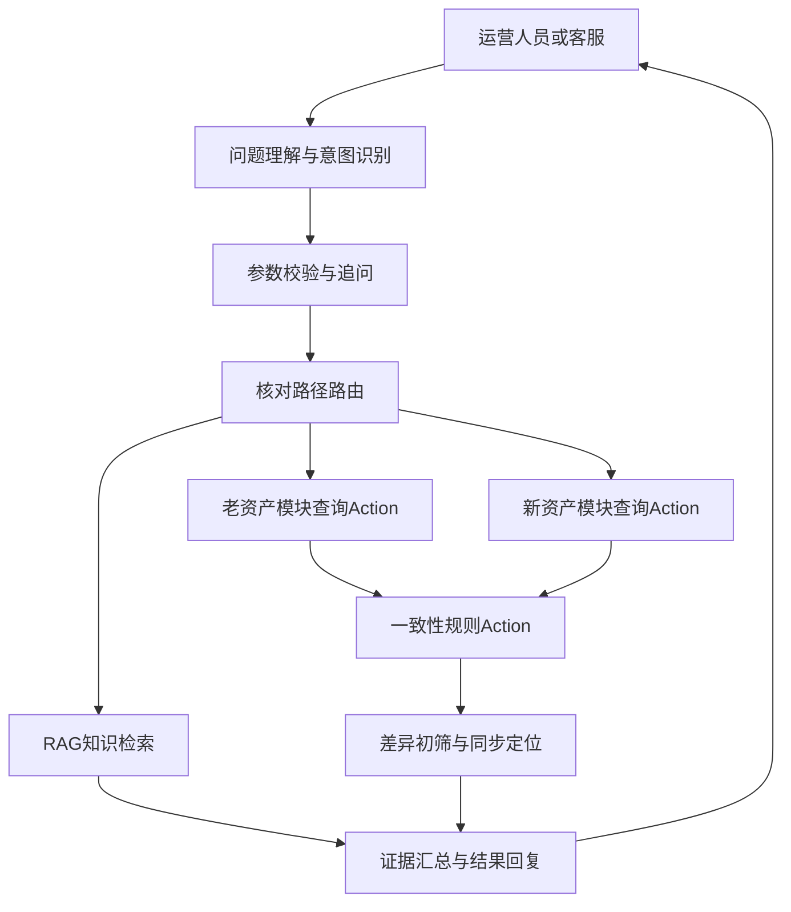

# 财经客服与资产核对 Agent 项目开发计划

## 1. 项目定位

在现有「LangChain + DeepSeek + 本地 RAG + CLI」财经客服 MVP 的基础上，逐步构建一个可演示、可测试的资产核对 Agent。项目最终聚焦于老采购资产模块与新资产模块双向同步后出现的缺失、重复、字段冲突和状态不一致问题。

本计划遵循先补齐 Agent 基础工作流、再接入业务 Action、最后构建核对闭环和效果度量的顺序。每一期均应可独立运行、测试和演示，避免先堆叠复杂业务逻辑再排查问题。

## 2. 当前基础与目标缺口

### 已有基础

- 使用 `langchain.agents.create_agent` 创建单 Agent，并接入 DeepSeek 模型。
- 使用 FAISS、中文 Embedding 模型和 `knowledge/` 文档构建本地 RAG。
- 支持命令行多轮对话和流式回复。
- 已有配置校验、RAG 索引缓存及基础单元测试。
- 已有资产核对说明文档，可作为资产领域 RAG 语料的起点。

### 需要补齐的能力

- 显式意图识别，而不是仅依赖模型自行判断是否调用工具。
- 自定义 LangGraph 工作流，清晰表达「问题理解 → 参数补充 → Tool 调用 → 结果回复」。
- 新旧资产系统的查询 Action、统一数据模型和一致性校验规则。
- 差异初筛、同步故障定位、证据汇总和结构化报告。
- 可复现的效率评估方法，证明或审慎评估运营投入降低目标。

## 3. 总体架构目标

建议在项目中以演示数据或模拟 API 表示老、新资产系统。这样既能完整体现 Agent 工程能力，也不会伪造真实生产系统访问能力。

## 4. 分期开发顺序

## 第一期：Agent 工作流底座与 RAG 质量完善

### 目标

将当前默认 Agent 图升级为可观察、可解释的 LangGraph 工作流，完成智能客服的意图识别、参数抽取和 RAG 问答主链路。

### 功能点

1. 定义统一会话状态
   - 保存用户问题、意图、已抽取参数、缺失参数、检索证据、工具调用结果和最终回复。
   - 保留当前多轮会话上下文，避免每轮都重复询问已给出的资产编号或采购单号。

2. 增加意图识别节点
   - 建议首批意图为：`faq_rag`、`asset_reconcile`、`accounting_difference`、`sync_diagnosis`、`out_of_scope`。
   - 对规则清晰的输入优先采用关键词或正则预判；复杂表述再使用 LLM 结构化分类。
   - 为分类结果设置置信度和兜底路径，避免错误路由直接进入资产核对。

3. 增加参数抽取与补充节点
   - 识别资产编号、采购单号、演示案例号、时间范围、核对范围等参数。
   - 资产核对至少要求一个查询键；缺失时生成一次明确追问，而不是调用空参数 Tool。
   - 参数已足够时直接进入后续节点，减少无效对话。

4. 建立显式 LangGraph 路由
   - `understand`：识别意图和提取实体。
   - `clarify`：判断是否需要补充参数。
   - `retrieve`：执行知识库检索。
   - `respond`：根据证据和工具结果生成可核验回复。
   - 本期保留现有 FAQ 问答能力，确保旧功能不回归。

5. 完善 RAG 工程能力
   - 统一 README、环境变量示例和索引命令的说明，消除索引入口不一致的问题。
   - 补充资产核对、状态映射、同步流程、账务差异处理等业务文档。
   - 建立小型问答评测集，覆盖命中、未命中、需要追问和超出范围四类问题。

### 验收标准

- 能展示自定义 LangGraph 的节点和路由关系。
- FAQ 类问题能够检索 `knowledge/` 并回答，同时显示或保留来源证据。
- 缺少资产查询键时，系统只追问必要参数。
- 意图识别、参数补充、RAG 检索和端到端会话均有自动化测试。

### 简历可对应表述

> 基于 LangChain 从 0 到 1 搭建智能客服，构建意图识别与本地 RAG 知识库，并使用 LangGraph 串联问题理解、参数补充、Tool 调用和结果回复流程。

## 第二期：资产数据模型与双端查询 Action

### 目标

将老采购资产模块和新资产模块抽象为可替换的数据访问层，提供可靠、可测试的查询能力，为 Agent 工具调用做好边界划分。

### 功能点

1. 确定演示数据方案
   - 在 `fixtures/` 或 SQLite 中分别维护老系统、新系统和同步流水数据。
   - 数据至少覆盖正常一致、单边缺失、同端重复、字段冲突、状态不一致和同步失败案例。
   - 明确数据为演示数据，避免和真实生产资产数据混用。

2. 定义统一资产领域模型
   - 标准字段包括资产编号、采购单号、名称、数量、金额、部门、位置、状态、创建时间、更新时间和同步批次。
   - 定义老系统与新系统状态映射表，例如待入库、在用、闲置、报废等。
   - 将原始字段和标准字段同时保留，便于问题追溯。

3. 封装双端查询 Action
   - `query_legacy_assets`：按资产编号、采购单号或案例号查询老系统。
   - `query_new_assets`：按相同条件查询新系统。
   - `query_sync_records`：查询同步批次、时间、方向、结果和错误信息。
   - Action 仅负责数据读取、校验和标准化，不包含由 LLM 决定的业务判断。

4. 注册为 Agent Tool
   - 为每个 Tool 定义清晰的输入 Schema、返回 Schema、异常语义和权限边界。
   - 将 Tool 返回结果转换为结构化证据，禁止模型将未查询的数据写成已验证事实。
   - 支持单端查询和双端查询两类路径。

### 验收标准

- 使用一个资产编号或采购单号可分别查询两端记录。
- 查询结果具备来源系统、查询条件、记录数量和原始证据。
- 不存在的查询键、重复记录和数据源异常都有明确且安全的返回。
- 双端查询 Action 与 Tool Schema 具备单元测试和固定案例测试。

### 简历可对应表述

> 将老采购资产模块与新资产模块的双端查询封装为可复用 Action，Agent 根据用户意图和已补全参数选择单端查询或双端核对路径。

## 第三期：一致性规则与资产核对工作流

### 目标

将数据缺失、重复、字段冲突和状态不一致沉淀为确定性规则，并由 Agent 汇总核对证据和建议处置方式。

### 功能点

1. 建立一致性规则 Action
   - 存在性规则：判断同一资产是否在两端均存在。
   - 重复规则：判断同一系统内是否存在多个有效记录。
   - 字段规则：比较名称、数量、金额、部门和存放位置等映射字段。
   - 状态规则：按照状态映射表比较新旧状态是否一致。
   - 为每条规则分配规则编号、严重等级、触发条件和建议动作。

2. 扩展 LangGraph 核对路由
   - 对 `asset_reconcile` 意图执行「参数校验 → 双端查询 → 一致性规则 → 证据汇总」。
   - 对低风险且信息完整的请求自动完成核对。
   - 对字段映射不明确、金额冲突或证据不足的场景转为人工确认建议，不让 Agent 擅自回写数据。

3. 统一核对报告
   - 输出查询范围、两端记录、命中规则、差异字段、严重等级、证据来源和建议动作。
   - 同时提供面向运营人员的自然语言摘要与面向程序处理的 JSON 结果。
   - 报告中区分「已验证事实」「规则推断」和「需要人工确认」。

4. 补充场景测试
   - 每种核心异常至少提供一个固定演示案例。
   - 覆盖缺失、重复、金额冲突、数量冲突、部门或位置冲突、状态映射冲突。

### 验收标准

- 输入有效资产标识后，Agent 能完成双端查询并输出统一核对报告。
- 报告可明确指出异常类型、受影响字段、证据和建议处理动作。
- 核对规则无需依赖 LLM 推理即可重复执行，保证结果稳定。
- 所有演示案例可通过测试或脚本重复复现。

### 简历可对应表述

> 围绕新旧资产模块双向同步产生的数据缺失、重复和状态不一致问题，将两端查询与一致性规则封装为 Action，Agent 负责补充参数、选择核对路径并汇总证据。

## 第四期：账务差异初筛与同步故障定位

### 目标

在资产核对结果上增加异常归因能力，使 Agent 不只发现差异，也能缩小问题定位范围。

### 功能点

1. 账务差异初筛
   - 接入或模拟采购金额、入账金额、折旧或台账金额等账务字段。
   - 按预定义阈值和规则识别金额缺失、金额不一致、数量与金额不匹配等情况。
   - 账务差异仅做初筛和证据展示，不输出税务、会计处理或资金决策结论。

2. 同步故障定位
   - 基于同步流水、批次号、方向、时间窗和错误码定位可能故障环节。
   - 区分新增未同步、更新未同步、重复投递、状态映射失败和人工补录等原因。
   - 输出排查顺序，例如先检查同步流水，再检查主数据映射，最后确认是否需要补同步。

3. 异常分级与人工协作
   - 定义高、中、低风险等级与升级条件。
   - 高风险金额或主数据冲突必须标为人工确认，禁止自动修复。
   - 记录人工确认结果，为后续规则优化提供样本。

### 验收标准

- 可针对账务字段差异生成初筛结论及其依据。
- 可通过模拟同步流水将异常归类到可执行的排查方向。
- 所有定位结论均附带查询证据和规则编号。

### 简历可对应表述

> 支持新旧资产数据核对、账务差异初筛和同步故障定位，并以结构化证据报告辅助运营人员处理异常。

## 第五期：效率度量、可观测性与演示交付

### 目标

形成可验证的项目效果和完整演示材料，避免将未经测量的效果直接写入简历。

### 功能点

1. 建立基线任务
   - 选择固定数量的典型工单，覆盖正常核对和常见异常。
   - 记录人工方式完成查询、比对、定位和整理报告的耗时。
   - 明确统计口径，例如从接收工单到形成可交接结论的总时间。

2. 设计对照实验
   - 使用相同工单，对比人工流程与 Agent 辅助流程。
   - 除耗时外，记录结果正确率、漏检率、人工介入次数和用户满意度。
   - 样本量和数据来源应在报告中明确标识为模拟数据或真实脱敏数据。

3. 增加可观测性
   - 记录意图路由、参数补充轮次、Tool 调用耗时、规则命中和失败原因。
   - 为每次核对生成可追溯的报告编号。
   - 提供 Markdown 或 JSON 格式的核对报告导出。

4. 准备项目演示
   - 演示 FAQ 问答、缺参追问、双端核对、重复识别、同步故障定位和报告导出。
   - 编写 README 中的架构图、运行步骤、演示案例和能力边界。
   - 使用测试结果或实验报告支撑项目效果描述。

### 验收标准

- 可复现记录人工与 Agent 辅助流程的耗时对比。
- 形成包含任务定义、样本数、指标、结果和限制的效果报告。
- CLI 或后续 API 演示可以完整走通至少一个异常处理闭环。

### 简历表述边界

只有在完成对照实验且统计结果满足目标时，才可以写：

> 月均重复运营投入时间降低 50%。

在尚未获得可核验数据前，应改为：

> 面向重复核对场景设计效率度量与自动化辅助方案，目标降低运营投入时间。

## 5. 推荐开发节奏

| 阶段 | 推荐周期 | 主要交付物 | 依赖关系 |
| --- | --- | --- | --- |
| 第一期 | 1～2 周 | 自定义 LangGraph、意图识别、参数补充、RAG 评测集 | 当前 RAG MVP |
| 第二期 | 1～2 周 | 模拟双端数据、统一资产模型、查询 Action 与 Tool | 第一期状态和路由 |
| 第三期 | 1～2 周 | 一致性规则、核对报告、异常案例测试 | 第二期双端查询 |
| 第四期 | 1 周 | 账务初筛、同步定位、人工确认边界 | 第三期规则与证据 |
| 第五期 | 1 周 | 效率报告、日志、演示文档 | 前四期稳定可运行 |

周期仅用于个人项目排期参考。若每期发现数据模型或规则定义不清，应优先补充业务规则和测试案例，不应通过提示词猜测规则。

## 6. 实施原则与风险控制

- 业务规则使用确定性代码或配置表达，LLM 只负责理解问题、补充参数、路由和解释结果。
- 所有 Tool 结果都带来源和查询条件，避免模型编造外部系统数据。
- 先使用模拟数据完成闭环；接入真实数据前需要增加鉴权、脱敏、审计和最小权限控制。
- 涉及账务、金额和状态回写的结论默认仅供初筛，保留人工确认环节。
- 「LangGraph」「Action」「降低 50%」均需要有对应代码、测试或实验材料支撑，避免简历描述超过项目实际能力。

## 7. 最终项目成果清单

- 可运行的 LangGraph 智能客服与资产核对 Agent。
- 可维护的 RAG 业务知识库和评测样例。
- 老、新资产模块的模拟数据源与查询 Action。
- 缺失、重复、字段冲突、状态不一致、账务差异和同步故障的规则库。
- 结构化核对报告、测试用例、运行文档和演示脚本。
- 效率对照实验记录，以及基于数据得出的简历成果描述。
